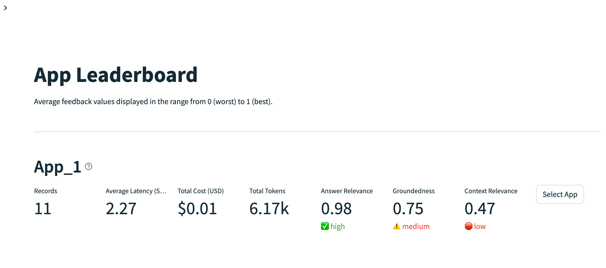

## Download BGE model
### Make sure you have git-lfs installed, and have HuggingFace token access

```bash
git lfs install
git clone git@hf.co:BAAI/bge-small-en-v1.5
```

## Run L1 and L2 notebook

### Open Leaderboard on http://localhost:8501



